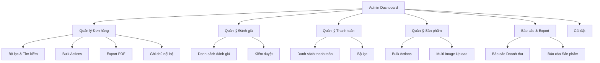

# Plan: Bổ sung Giao diện Admin Nâng cao

## Tổng quan

Plan này bổ sung các tính năng nâng cao cho giao diện admin, tập trung vào:

- Quản lý đơn hàng nâng cao (filter, search, PDF export)
- Quản lý đánh giá & bình luận
- Quản lý thanh toán đầy đủ
- Cải thiện quản lý sản phẩm (bulk actions)
- Báo cáo & Export
- Cài đặt hệ thống

## Kiến trúc




## Phase 1: Quản lý Đơn hàng Nâng cao

### 1.1. Bộ lọc & Tìm kiếm Đơn hàng

**File:** `product_management/lib/features/orders/presentation/screens/order_list_screen.dart`**Thay đổi:**

- Thêm `OrderFilterBottomSheet` widget để lọc theo:
- Trạng thái (Pending, Confirmed, Shipped, Delivered, Cancelled)
- Khoảng ngày (từ ngày - đến ngày)
- Tìm kiếm theo mã đơn, tên khách hàng, email
- Thêm state management cho filters
- Cập nhật `OrderProvider` để hỗ trợ filter queries

**Files cần tạo:**

- `product_management/lib/features/orders/presentation/widgets/order_filter_bottom_sheet.dart`

### 1.2. Export PDF Hóa đơn

**File mới:** `product_management/lib/features/orders/presentation/screens/order_invoice_screen.dart`**Thay đổi:**

- Tích hợp package `pdf` hoặc `printing` để tạo PDF
- Tạo template hóa đơn với:
- Thông tin cửa hàng
- Thông tin khách hàng
- Chi tiết sản phẩm
- Tổng tiền, thuế (nếu có)
- Mã đơn hàng, ngày
- Thêm nút "In hóa đơn" trong `OrderDetailScreen`

**Dependencies cần thêm:**

- `pdf: ^3.10.0` hoặc `printing: ^5.12.0`

### 1.3. Ghi chú Nội bộ cho Đơn hàng

**Thay đổi:**

- Thêm field `adminNotes` vào Order entity (nếu chưa có)
- Tạo API endpoint để lưu ghi chú (backend)
- Thêm widget `OrderNotesSection` trong `OrderDetailScreen`
- Cho phép admin thêm/sửa/xóa ghi chú

**Files cần tạo:**

- `product_management/lib/features/orders/presentation/widgets/order_notes_widget.dart`

### 1.4. Bulk Actions cho Đơn hàng

**Thay đổi:**

- Thêm checkbox selection mode trong `OrderListScreen`
- Thêm action bar khi có items được chọn
- Hỗ trợ bulk update status
- Hỗ trợ bulk export PDF

**Files cần tạo:**

- `product_management/lib/features/orders/presentation/widgets/order_bulk_actions_bar.dart`

## Phase 2: Quản lý Đánh giá & Bình luận

### 2.1. Màn hình Quản lý Đánh giá

**File mới:** `product_management/lib/features/ratings/presentation/screens/admin_rating_management_screen.dart`**Tính năng:**

- Danh sách tất cả đánh giá với pagination
- Hiển thị: sản phẩm, người dùng, sao, bình luận, ngày
- Bộ lọc theo:
- Sản phẩm
- Số sao (1-5)
- Ngày
- Tìm kiếm theo tên sản phẩm, tên người dùng

**Files cần tạo:**

- `product_management/lib/features/ratings/presentation/screens/admin_rating_management_screen.dart`
- `product_management/lib/features/ratings/presentation/widgets/rating_filter_widget.dart`
- `product_management/lib/features/ratings/presentation/widgets/rating_list_item.dart`

### 2.2. Kiểm duyệt Đánh giá

**Thay đổi:**

- Thêm action buttons: Xóa, Ẩn/Hiện
- Thêm dialog xác nhận trước khi xóa
- Cập nhật `RatingProvider` để hỗ trợ delete rating

**Files cần cập nhật:**

- `product_management/lib/features/ratings/presentation/providers/rating_provider.dart` (đã có deleteRating)

### 2.3. Thêm vào Admin Drawer

**File:** `product_management/lib/features/shared/presentation/widgets/admin_drawer.dart`**Thay đổi:**

- Thêm menu item "Quản lý đánh giá" với icon `Icons.star_rate`

## Phase 3: Quản lý Thanh toán

### 3.1. Màn hình Quản lý Thanh toán

**File mới:** `product_management/lib/features/payments/presentation/screens/admin_payment_management_screen.dart`**Tính năng:**

- Danh sách tất cả giao dịch thanh toán
- Hiển thị: ID, Order ID, Số tiền, Phương thức, Trạng thái, Ngày
- Bộ lọc theo:
- Trạng thái (Pending, Paid, Failed)
- Phương thức thanh toán
- Khoảng ngày
- Order ID
- Tìm kiếm theo Order ID, Payment ID

**Files cần tạo:**

- `product_management/lib/features/payments/presentation/screens/admin_payment_management_screen.dart`
- `product_management/lib/features/payments/presentation/widgets/payment_filter_widget.dart`
- `product_management/lib/features/payments/presentation/widgets/payment_list_item.dart`

### 3.2. Cập nhật PaymentProvider

**File:** `product_management/lib/features/payments/presentation/providers/payment_provider.dart`**Thay đổi:**

- Thêm method `fetchAllPayments()` để lấy tất cả payments
- Thêm filter state management

### 3.3. Thêm vào Admin Drawer

**File:** `product_management/lib/features/shared/presentation/widgets/admin_drawer.dart`**Thay đổi:**

- Thêm menu item "Quản lý thanh toán" với icon `Icons.payment`

## Phase 4: Cải thiện Quản lý Sản phẩm

### 4.1. Bulk Actions cho Sản phẩm

**File:** `product_management/lib/features/products/presentation/screens/admin_product_list_screen.dart`**Thay đổi:**

- Thêm selection mode với checkbox
- Hỗ trợ chọn nhiều sản phẩm
- Action bar với các actions:
- Xóa hàng loạt
- Ẩn/Hiện hàng loạt
- Thay đổi danh mục hàng loạt

**Files cần tạo:**

- `product_management/lib/features/products/presentation/widgets/product_bulk_actions_bar.dart`

### 4.2. Multi-Image Upload (Tùy chọn - nếu cần)

**File:** `product_management/lib/features/products/presentation/screens/product_form_screen.dart`**Thay đổi:**

- Thay đổi từ single image sang image gallery
- Sử dụng `image_picker` để chọn nhiều ảnh
- Hiển thị slider ảnh trong form
- Lưu danh sách URLs vào database

**Dependencies:**

- `image_picker: ^1.0.0`
- `carousel_slider: ^4.2.0`

## Phase 5: Báo cáo & Export

### 5.1. Báo cáo Doanh thu Export

**File:** `product_management/lib/features/dashboard/presentation/screens/revenue_analytics_screen.dart`**Thay đổi:**

- Thêm nút "Export Excel" hoặc "Export PDF"
- Tạo báo cáo với:
- Doanh thu theo ngày/tuần/tháng
- Top sản phẩm bán chạy
- Thống kê đơn hàng

**Dependencies:**

- `excel: ^2.1.0` hoặc `pdf: ^3.10.0`

### 5.2. Báo cáo Sản phẩm

**File mới:** `product_management/lib/features/dashboard/presentation/screens/product_report_screen.dart`**Tính năng:**

- Báo cáo sản phẩm bán chạy
- Báo cáo sản phẩm tồn kho
- Export Excel/PDF

## Phase 6: Cài đặt Hệ thống

### 6.1. Màn hình Cài đặt

**File mới:** `product_management/lib/features/settings/presentation/screens/admin_settings_screen.dart`**Tính năng:**

- Thông tin cửa hàng (tên, địa chỉ, SĐT, email)
- Cảnh báo tồn kho (ngưỡng cảnh báo)
- Cài đặt thanh toán (bật/tắt phương thức)
- Cài đặt khác

**Files cần tạo:**

- `product_management/lib/features/settings/presentation/screens/admin_settings_screen.dart`
- `product_management/lib/features/settings/presentation/providers/settings_provider.dart`

### 6.2. Thêm vào Admin Drawer

**File:** `product_management/lib/features/shared/presentation/widgets/admin_drawer.dart`**Thay đổi:**

- Thêm menu item "Cài đặt" với icon `Icons.settings`

## Cấu trúc Files

```javascript
product_management/lib/features/
├── orders/
│   └── presentation/
│       ├── screens/
│       │   ├── order_list_screen.dart (cập nhật)
│       │   ├── order_detail_screen.dart (cập nhật)
│       │   └── order_invoice_screen.dart (mới)
│       └── widgets/
│           ├── order_filter_bottom_sheet.dart (mới)
│           ├── order_notes_widget.dart (mới)
│           └── order_bulk_actions_bar.dart (mới)
├── ratings/
│   └── presentation/
│       ├── screens/
│       │   └── admin_rating_management_screen.dart (mới)
│       └── widgets/
│           ├── rating_filter_widget.dart (mới)
│           └── rating_list_item.dart (mới)
├── payments/
│   └── presentation/
│       ├── screens/
│       │   └── admin_payment_management_screen.dart (mới)
│       └── widgets/
│           ├── payment_filter_widget.dart (mới)
│           └── payment_list_item.dart (mới)
├── products/
│   └── presentation/
│       ├── screens/
│       │   └── admin_product_list_screen.dart (cập nhật)
│       └── widgets/
│           └── product_bulk_actions_bar.dart (mới)
├── dashboard/
│   └── presentation/
│       └── screens/
│           ├── revenue_analytics_screen.dart (cập nhật)
│           └── product_report_screen.dart (mới)
├── settings/
│   └── presentation/
│       ├── screens/
│       │   └── admin_settings_screen.dart (mới)
│       └── providers/
│           └── settings_provider.dart (mới)
└── shared/
    └── presentation/
        └── widgets/
            └── admin_drawer.dart (cập nhật)
```


## Dependencies cần thêm

```yaml
dependencies:
  pdf: ^3.10.0  # hoặc printing: ^5.12.0
  excel: ^2.1.0  # cho export Excel
  image_picker: ^1.0.0  # cho multi-image (nếu cần)
  carousel_slider: ^4.2.0  # cho image slider (nếu cần)
  intl: ^0.19.0  # đã có, cho format date
```


## Lưu ý Implementation

1. **API Endpoints:** Một số tính năng có thể cần thêm API endpoints ở backend (ví dụ: adminNotes cho Order, getAllPayments, getAllRatings)
2. **State Management:** Sử dụng Provider pattern đã có sẵn trong project
3. **UI/UX:** 

- Giữ consistency với design system hiện tại (`AppColors`, `design_system.dart`)
- Sử dụng Material 3 components
- Responsive design

4. **Error Handling:** Thêm proper error handling và loading states
5. **Performance:** 

- Pagination cho danh sách dài
- Lazy loading cho images
- Debounce cho search inputs

## Thứ tự ưu tiên Implementation

1. **Phase 1.1** - Bộ lọc & Tìm kiếm Đơn hàng (quan trọng nhất)
2. **Phase 2** - Quản lý Đánh giá (API đã có sẵn)
3. **Phase 3** - Quản lý Thanh toán (API đã có sẵn)
4. **Phase 1.2** - Export PDF
5. **Phase 4** - Bulk Actions