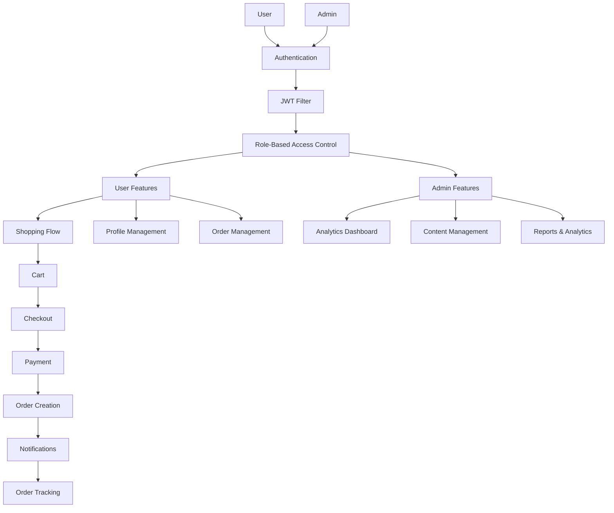

#Product Management App - Comprehensive Improvement Plan

## Tổng quan

Plan này chia thành 6 phases, phát triển song song tính năng User và Admin, từ nền tảng bảo mật đến các tính năng nâng cao.

## Phase 0: Foundation & Security (CRITICAL - Ưu tiên cao nhất)

### Mục tiêu

Xây dựng nền tảng bảo mật vững chắc, đảm bảo ứng dụng an toàn trước khi phát triển tính năng mới.

### Tasks

#### Task 0.1: Implement JWT Authentication Filter

**Files:**

- `api/src/main/java/com/husc/productmanagement/config/JwtAuthenticationFilter.java` (NEW)
- `api/src/main/java/com/husc/productmanagement/config/SecurityConfig.java` (UPDATE)

**Implementation:**

- Tạo JwtAuthenticationFilter extends OncePerRequestFilter
- Extract JWT token từ Authorization header
- Validate token sử dụng JwtUtil
- Extract user info và role từ token
- Set authentication vào SecurityContext
- Handle token expiration và invalid tokens
- Update SecurityConfig để thêm filter vào chain

#### Task 0.2: Implement Role-Based Authorization

**Files:**

- `api/src/main/java/com/husc/productmanagement/config/SecurityConfig.java` (UPDATE)
- `api/src/main/java/com/husc/productmanagement/controller/ProductController.java` (UPDATE)
- `api/src/main/java/com/husc/productmanagement/controller/CategoryController.java` (UPDATE)
- `api/src/main/java/com/husc/productmanagement/controller/OrderController.java` (UPDATE)
- `api/src/main/java/com/husc/productmanagement/controller/UserController.java` (UPDATE)
- `api/src/main/java/com/husc/productmanagement/controller/DashboardController.java` (UPDATE)

**Implementation:**

- Enable method security: `@EnableMethodSecurity` trong SecurityConfig
- Update SecurityConfig: Remove `.permitAll()` cho protected endpoints
- Protect admin endpoints với `@PreAuthorize("hasRole('ADMIN')")`:
- ProductController: createProduct, updateProduct, deleteProduct
- CategoryController: createCategory, updateCategory, deleteCategory
- OrderController: updateOrderStatus
- UserController: getAllUsers, deleteUser
- DashboardController: all endpoints (admin only)
- Allow both roles cho user-accessible endpoints: `@PreAuthorize("hasRole('USER') or hasRole('ADMIN')")`
- Keep public: `/api/auth/**`, GET `/api/products`, GET `/api/categories`

#### Task 0.3: Enhance Input Validation

**Files:**

- `api/src/main/java/com/husc/productmanagement/dto/ProductDTO.java` (UPDATE)
- `api/src/main/java/com/husc/productmanagement/dto/CategoryDTO.java` (UPDATE)
- `api/src/main/java/com/husc/productmanagement/dto/OrderDTO.java` (UPDATE)
- `api/src/main/java/com/husc/productmanagement/dto/UserDTO.java` (UPDATE)
- `product_management/lib/features/orders/presentation/screens/checkout_screen.dart` (UPDATE)
- `product_management/lib/features/products/presentation/screens/product_form_screen.dart` (UPDATE)

**Implementation:**

- Backend: Add `@NotNull`, `@NotBlank`, `@Min`, `@Max`, `@Email`, `@Pattern` annotations
- Frontend: Enhance form validation
- Email: Use EmailValidator hoặc regex
- Phone: Vietnamese format validation (0xxxxxxxxx)
- Price: Must be > 0
- Quantity: Must be > 0, integer
- Show validation errors clearly
- Disable submit button if form invalid

#### Task 0.4: Improve Error Handling

**Files:**

- `api/src/main/java/com/husc/productmanagement/exception/GlobalExceptionHandler.java` (UPDATE)
- `product_management/lib/core/utils/error_messages.dart` (NEW)
- `product_management/lib/api/api_service.dart` (UPDATE)

**Implementation:**

- Backend: Add specific exception handlers (UnauthorizedException, ForbiddenException, etc.)
- Frontend: Create ErrorMessages constants class
- Update ApiService error parsing với consistent messages
- Add user-friendly error messages cho tất cả API calls

---

## Phase 1: Core User Features (Essential)

### Mục tiêu

Hoàn thiện trải nghiệm mua sắm cơ bản cho người dùng.

### Tasks

#### Task 1.1: Product Rating & Review System

**Files:**

- `product_management/lib/features/ratings/presentation/screens/product_rating_screen.dart` (NEW)
- `product_management/lib/features/ratings/presentation/screens/rating_list_screen.dart` (NEW)
- `product_management/lib/features/products/presentation/screens/product_detail_screen.dart` (UPDATE)
- `product_management/lib/features/products/presentation/widgets/rating_widget.dart` (NEW)
- `product_management/lib/features/ratings/presentation/widgets/rating_form_widget.dart` (NEW)

**Implementation:**

- Create ProductRatingScreen: Hiển thị danh sách đánh giá, form tạo đánh giá
- Create RatingListScreen: Danh sách đánh giá với filter (all, 5-star, 4-star, etc.)
- Update ProductDetailScreen: Thêm section hiển thị ratings, link đến rating screen
- Create RatingWidget: Hiển thị stars, average rating, total reviews
- Create RatingFormWidget: Form tạo đánh giá (rating 1-5, comment, optional image)
- Integrate với RatingProvider

#### Task 1.2: Advanced Product Search & Filter

**Files:**

- `product_management/lib/features/products/presentation/screens/product_filter_screen.dart` (NEW)
- `product_management/lib/features/products/presentation/screens/user_product_list_screen.dart` (UPDATE)
- `api/src/main/java/com/husc/productmanagement/controller/ProductController.java` (UPDATE)
- `api/src/main/java/com/husc/productmanagement/service/ProductService.java` (UPDATE)

**Implementation:**

- Create ProductFilterScreen: Filter dialog với options:
- Price range (slider)
- Category (multi-select)
- Rating (4+, 3+, etc.)
- Sort options (price low-high, price high-low, rating, newest)
- Update UserProductListScreen: Thêm filter button, apply filters
- Backend: Add filter endpoints:
- `/api/products/filter?minPrice=&maxPrice=&categoryId=&minRating=&sortBy=`
- Update ProductService với filter logic

#### Task 1.3: Address Management

**Files:**

- `product_management/lib/features/users/presentation/screens/address_list_screen.dart` (NEW)
- `product_management/lib/features/users/presentation/screens/address_form_screen.dart` (NEW)
- `product_management/lib/features/orders/presentation/screens/checkout_screen.dart` (UPDATE)
- `api/src/main/java/com/husc/productmanagement/entity/Address.java` (NEW)
- `api/src/main/java/com/husc/productmanagement/controller/AddressController.java` (NEW)
- `api/src/main/java/com/husc/productmanagement/service/AddressService.java` (NEW)

**Implementation:**

- Create Address entity với fields: userId, name, phone, address, isDefault
- Create AddressController với CRUD endpoints
- Create AddressListScreen: Danh sách địa chỉ, set default, edit, delete
- Create AddressFormScreen: Form thêm/sửa địa chỉ
- Update CheckoutScreen: Dropdown chọn địa chỉ đã lưu, option thêm địa chỉ mới

#### Task 1.4: Order Status Tracking & Notifications

**Files:**

- `product_management/lib/features/orders/presentation/screens/order_tracking_screen.dart` (NEW)
- `product_management/lib/features/orders/presentation/screens/user_order_history_screen.dart` (UPDATE)
- `product_management/lib/features/orders/presentation/widgets/order_status_timeline.dart` (NEW)
- `product_management/lib/core/services/notification_service.dart` (NEW)

**Implementation:**

- Create OrderTrackingScreen: Timeline hiển thị trạng thái đơn hàng
- Create OrderStatusTimeline widget: Visual timeline với icons
- Update UserOrderHistoryScreen: Thêm tracking button, real-time status updates
- Create NotificationService: Local notifications cho order status changes
- Backend: Add order status history tracking trong Order entity

#### Task 1.5: Enhanced Cart Features

**Files:**

- `product_management/lib/features/orders/presentation/screens/cart_screen.dart` (UPDATE)
- `product_management/lib/features/orders/presentation/providers/cart_provider.dart` (UPDATE)

**Implementation:**

- Add stock validation: Check quantity before add to cart, show warning if low stock
- Add save cart to backend: Sync cart với server
- Add cart persistence: Save cart locally, restore on app restart
- Show out-of-stock warnings
- Update quantity validation: Prevent negative or zero quantities

---

## Phase 2: Core Admin Features (Essential)

### Mục tiêu

Hoàn thiện công cụ quản lý cơ bản cho admin.

### Tasks

#### Task 2.1: User Management System

**Files:**

- `product_management/lib/features/users/presentation/screens/admin_user_list_screen.dart` (NEW)
- `product_management/lib/features/users/presentation/screens/admin_user_detail_screen.dart` (NEW)
- `product_management/lib/features/shared/screens/admin_dashboard_screen.dart` (UPDATE)
- `api/src/main/java/com/husc/productmanagement/controller/UserController.java` (UPDATE)

**Implementation:**

- Create AdminUserListScreen: 
- List users với search, filter (role, status)
- Actions: View detail, activate/deactivate, delete
- Create AdminUserDetailScreen:
- User info, order history, statistics
- Actions: Edit, change role, activate/deactivate
- Update AdminDashboardScreen: Thêm Users tab
- Backend: Add user search, filter endpoints

#### Task 2.2: Advanced Order Management

**Files:**

- `product_management/lib/features/orders/presentation/screens/order_list_screen.dart` (UPDATE)
- `product_management/lib/features/orders/presentation/screens/order_detail_screen.dart` (UPDATE)
- `product_management/lib/features/orders/presentation/widgets/order_filter_dialog.dart` (NEW)
- `api/src/main/java/com/husc/productmanagement/controller/OrderController.java` (UPDATE)

**Implementation:**

- Create OrderFilterDialog: Filter by date range, status, customer, amount range
- Update OrderListScreen: 
- Add filter button, search bar
- Bulk actions (update multiple orders)
- Export to CSV/Excel
- Update OrderDetailScreen:
- Add notes field
- Status change history
- Print invoice button
- Backend: Add filter, search, export endpoints

#### Task 2.3: Enhanced Product Management

**Files:**

- `product_management/lib/features/products/presentation/screens/admin_product_list_screen.dart` (UPDATE)
- `product_management/lib/features/products/presentation/screens/product_form_screen.dart` (UPDATE)
- `api/src/main/java/com/husc/productmanagement/controller/ProductController.java` (UPDATE)

**Implementation:**

- Update AdminProductListScreen:
- Bulk edit/delete
- Duplicate product
- Import/Export CSV
- Advanced filters
- Update ProductFormScreen:
- Multiple image upload
- Product variants (size, color) - optional
- SEO fields (meta title, description)
- Backend: Add bulk operations, import/export endpoints

#### Task 2.4: Advanced Dashboard Analytics

**Files:**

- `product_management/lib/features/dashboard/presentation/screens/dashboard_overview_screen.dart` (UPDATE)
- `product_management/lib/features/dashboard/presentation/screens/revenue_report_screen.dart` (NEW)
- `product_management/lib/features/dashboard/presentation/screens/customer_analytics_screen.dart` (NEW)
- `api/src/main/java/com/husc/productmanagement/controller/DashboardController.java` (UPDATE)

**Implementation:**

- Create RevenueReportScreen: 
- Revenue by product, category
- Date range comparison
- Export PDF/Excel
- Create CustomerAnalyticsScreen:
- Customer segmentation (RFM analysis)
- New vs returning customers
- Customer lifetime value
- Update DashboardOverviewScreen: Add links to detailed reports
- Backend: Add analytics endpoints

#### Task 2.5: Inventory Management Enhancements

**Files:**

- `product_management/lib/features/inventory/presentation/screens/inventory_logs_screen.dart` (UPDATE)
- `product_management/lib/features/inventory/presentation/screens/low_stock_alert_screen.dart` (NEW)
- `api/src/main/java/com/husc/productmanagement/controller/InventoryController.java` (UPDATE)

**Implementation:**

- Create LowStockAlertScreen: List products với quantity <= threshold
- Update InventoryLogsScreen:
- Filter by product, date, type
- Export reports
- Backend: Add low stock alerts, inventory reports

---

## Phase 3: Advanced User Features

### Mục tiêu

Nâng cao trải nghiệm người dùng với tính năng nâng cao.

### Tasks

#### Task 3.1: Payment Integration

**Files:**

- `product_management/lib/features/payments/presentation/screens/payment_methods_screen.dart` (NEW)
- `product_management/lib/features/payments/presentation/screens/payment_history_screen.dart` (NEW)
- `product_management/lib/features/orders/presentation/screens/checkout_screen.dart` (UPDATE)
- `api/src/main/java/com/husc/productmanagement/service/PaymentService.java` (UPDATE)

**Implementation:**

- Create PaymentMethodsScreen: Manage saved payment methods
- Create PaymentHistoryScreen: Transaction history
- Update CheckoutScreen: Integrate payment gateways (VNPay, Momo, etc.)
- Backend: Add payment gateway integration, transaction tracking

#### Task 3.2: Coupon & Promotion System

**Files:**

- `product_management/lib/features/promotions/presentation/screens/coupon_list_screen.dart` (NEW)
- `product_management/lib/features/promotions/presentation/screens/apply_coupon_screen.dart` (NEW)
- `product_management/lib/features/orders/presentation/screens/checkout_screen.dart` (UPDATE)
- `api/src/main/java/com/husc/productmanagement/entity/Coupon.java` (NEW)
- `api/src/main/java/com/husc/productmanagement/controller/CouponController.java` (NEW)

**Implementation:**

- Create Coupon entity: code, discountType, discountValue, minPurchase, expiryDate
- Create CouponListScreen: Available coupons for user
- Create ApplyCouponScreen: Apply coupon code
- Update CheckoutScreen: Add coupon input, apply discount
- Backend: Coupon validation, discount calculation

#### Task 3.3: Product Comparison

**Files:**

- `product_management/lib/features/products/presentation/screens/product_comparison_screen.dart` (NEW)
- `product_management/lib/features/products/presentation/widgets/compare_button.dart` (NEW)
- `product_management/lib/features/products/presentation/providers/comparison_provider.dart` (NEW)

**Implementation:**

- Create ComparisonProvider: Manage comparison list (max 3-4 products)
- Create ProductComparisonScreen: Side-by-side comparison table
- Create CompareButton: Add/remove from comparison
- Show comparison button on product cards

#### Task 3.4: View History & Recently Viewed

**Files:**

- `product_management/lib/features/products/presentation/screens/view_history_screen.dart` (NEW)
- `product_management/lib/core/services/view_history_service.dart` (NEW)
- `product_management/lib/features/products/presentation/screens/product_detail_screen.dart` (UPDATE)

**Implementation:**

- Create ViewHistoryService: Track viewed products (local storage)
- Create ViewHistoryScreen: List recently viewed products
- Update ProductDetailScreen: Track view on open
- Add view history section in user profile

#### Task 3.5: Social Sharing

**Files:**

- `product_management/lib/features/products/presentation/widgets/share_button.dart` (NEW)
- `product_management/lib/core/services/share_service.dart` (NEW)

**Implementation:**

- Create ShareService: Share product via social media, copy link
- Create ShareButton: Share widget
- Add share button to product detail screen

#### Task 3.6: Help & Support

**Files:**

- `product_management/lib/features/support/presentation/screens/help_center_screen.dart` (NEW)
- `product_management/lib/features/support/presentation/screens/faq_screen.dart` (NEW)
- `product_management/lib/features/support/presentation/screens/contact_support_screen.dart` (NEW)
- `product_management/lib/features/shared/screens/user_main_screen.dart` (UPDATE)

**Implementation:**

- Create HelpCenterScreen: Main help page với categories
- Create FAQScreen: Frequently asked questions
- Create ContactSupportScreen: Contact form, live chat integration
- Update UserProfileTab: Implement help & support button

---

## Phase 4: Advanced Admin Features

### Mục tiêu

Công cụ quản lý nâng cao và tự động hóa.

### Tasks

#### Task 4.1: Promotion Management

**Files:**

- `product_management/lib/features/promotions/presentation/screens/admin_promotion_list_screen.dart` (NEW)
- `product_management/lib/features/promotions/presentation/screens/admin_promotion_form_screen.dart` (NEW)
- `api/src/main/java/com/husc/productmanagement/entity/Promotion.java` (NEW)
- `api/src/main/java/com/husc/productmanagement/controller/PromotionController.java` (NEW)

**Implementation:**

- Create Promotion entity: name, type, discount, startDate, endDate, products
- Create AdminPromotionListScreen: List promotions, activate/deactivate
- Create AdminPromotionFormScreen: Create/edit promotions
- Backend: Promotion CRUD, validation

#### Task 4.2: Rating & Review Management

**Files:**

- `product_management/lib/features/ratings/presentation/screens/admin_rating_list_screen.dart` (NEW)
- `api/src/main/java/com/husc/productmanagement/controller/ProductRatingController.java` (UPDATE)

**Implementation:**

- Create AdminRatingListScreen: 
- List all ratings với filter
- Approve/reject ratings
- Delete inappropriate ratings
- Reply to reviews
- Backend: Add admin endpoints for rating management

#### Task 4.3: Payment Management

**Files:**

- `product_management/lib/features/payments/presentation/screens/admin_payment_list_screen.dart` (NEW)
- `product_management/lib/features/payments/presentation/screens/payment_detail_screen.dart` (UPDATE)

**Implementation:**

- Create AdminPaymentListScreen:
- List all payments với filters
- Search, filter by status, date, amount
- Approve/reject payments
- Refund functionality
- Update PaymentDetailScreen: Admin view với actions

#### Task 4.4: Category Management Enhancements

**Files:**

- `product_management/lib/features/categories/presentation/screens/category_management_screen.dart` (UPDATE)
- `product_management/lib/features/categories/presentation/screens/category_form_screen.dart` (UPDATE)
- `api/src/main/java/com/husc/productmanagement/entity/Category.java` (UPDATE)

**Implementation:**

- Add subcategories support: parentCategoryId field
- Add category image/icon upload
- Add category ordering: displayOrder field
- Add SEO fields: metaTitle, metaDescription
- Update CategoryFormScreen: Support subcategories, image upload

#### Task 4.5: System Settings

**Files:**

- `product_management/lib/features/settings/presentation/screens/admin_settings_screen.dart` (NEW)
- `api/src/main/java/com/husc/productmanagement/entity/SystemSetting.java` (NEW)
- `api/src/main/java/com/husc/productmanagement/controller/SettingController.java` (NEW)

**Implementation:**

- Create SystemSetting entity: key-value settings
- Create AdminSettingsScreen:
- Shipping configuration
- Payment gateway settings
- Email templates
- Notification settings
- Backend: Settings CRUD API

#### Task 4.6: Advanced Reporting

**Files:**

- `product_management/lib/features/dashboard/presentation/screens/inventory_report_screen.dart` (NEW)
- `product_management/lib/features/dashboard/presentation/screens/sales_report_screen.dart` (NEW)
- `api/src/main/java/com/husc/productmanagement/controller/ReportController.java` (NEW)

**Implementation:**

- Create InventoryReportScreen: Stock reports, low stock alerts
- Create SalesReportScreen: Sales by product, category, period
- Backend: Report generation, export PDF/Excel
- Add scheduled report generation

---

## Phase 5: Polish & Optimization

### Mục tiêu

Hoàn thiện UI/UX, tối ưu hiệu năng, và các tính năng bổ sung.

### Tasks

#### Task 5.1: Dark Mode Implementation

**Files:**

- `product_management/lib/core/theme/app_theme.dart` (NEW)
- `product_management/lib/core/services/theme_service.dart` (NEW)
- `product_management/lib/features/shared/screens/settings_screen.dart` (UPDATE)
- `product_management/lib/main.dart` (UPDATE)

**Implementation:**

- Create AppTheme: Define light và dark themes
- Create ThemeService: Manage theme state, persistence
- Update SettingsScreen: Theme toggle
- Update main.dart: Wrap app với ThemeProvider
- Test all screens với dark mode

#### Task 5.2: Multi-language Support

**Files:**

- `product_management/lib/core/localization/app_localizations.dart` (NEW)
- `product_management/lib/core/localization/app_localizations_en.dart` (NEW)
- `product_management/lib/core/localization/app_localizations_vi.dart` (NEW)
- `product_management/lib/features/shared/screens/settings_screen.dart` (UPDATE)
- `product_management/pubspec.yaml` (UPDATE)

**Implementation:**

- Add flutter_localizations dependency
- Create localization files cho English và Vietnamese
- Create AppLocalizations class
- Update SettingsScreen: Language selector
- Update all hardcoded strings to use localization

#### Task 5.3: Performance Optimization

**Files:**

- `product_management/lib/features/products/presentation/screens/user_product_list_screen.dart` (UPDATE)
- `product_management/lib/features/products/presentation/widgets/product_card_user.dart` (UPDATE)
- `product_management/lib/api/api_service.dart` (UPDATE)

**Implementation:**

- Implement pagination: Load products in pages
- Add lazy loading: Load images on demand
- Optimize API calls: Debounce search, cache responses
- Add loading skeletons
- Optimize list rendering: Use ListView.builder properly

#### Task 5.4: Offline Support

**Files:**

- `product_management/lib/core/services/offline_service.dart` (NEW)
- `product_management/lib/core/database/local_database.dart` (NEW)
- `product_management/lib/features/products/presentation/providers/product_provider.dart` (UPDATE)

**Implementation:**

- Create LocalDatabase: SQLite database cho offline data
- Create OfflineService: Sync data when online
- Update ProductProvider: Cache products locally
- Handle offline mode: Show cached data, queue actions

#### Task 5.5: Push Notifications

**Files:**

- `product_management/lib/core/services/push_notification_service.dart` (NEW)
- `api/src/main/java/com/husc/productmanagement/service/NotificationService.java` (NEW)

**Implementation:**

- Integrate Firebase Cloud Messaging
- Create PushNotificationService: Handle notifications
- Backend: Send notifications for order updates
- Register device tokens, handle notification clicks

#### Task 5.6: Image Upload & Management

**Files:**

- `product_management/lib/core/services/image_picker_service.dart` (NEW)
- `product_management/lib/core/services/image_upload_service.dart` (NEW)
- `api/src/main/java/com/husc/productmanagement/controller/FileUploadController.java` (NEW)

**Implementation:**

- Create ImagePickerService: Pick images from gallery/camera
- Create ImageUploadService: Upload to server/cloud storage
- Backend: File upload endpoint, store in cloud (AWS S3, Cloudinary, etc.)
- Update ProductFormScreen: Multiple image upload

#### Task 5.7: User Profile Enhancements

**Files:**

- `product_management/lib/features/users/presentation/screens/edit_profile_screen.dart` (UPDATE)
- `product_management/lib/features/auth/presentation/screens/change_password_screen.dart` (NEW)
- `api/src/main/java/com/husc/productmanagement/controller/UserController.java` (UPDATE)

**Implementation:**

- Update EditProfileScreen: Avatar upload, better form
- Create ChangePasswordScreen: Change password functionality
- Backend: Add change password endpoint
- Add email verification flow

#### Task 5.8: Testing & Bug Fixes

**Files:**

- `product_management/test/` (ADD TESTS)
- `api/src/test/` (ADD TESTS)

**Implementation:**

- Write unit tests cho critical features
- Write integration tests cho API endpoints
- Fix bugs discovered during testing
- Performance testing và optimization

---

## Architecture Flow

## Dependencies & Prerequisites

### Flutter Packages

- `flutter_localizations` - Multi-language
- `image_picker` - Image selection
- `firebase_messaging` - Push notifications
- `sqflite` - Local database
- `share_plus` - Social sharing
- `pdf` - PDF generation
- `excel` - Excel export

### Backend Dependencies

- Spring Security Method Security
- File upload libraries
- PDF generation libraries
- Email service integration

## Estimated Timeline

- **Phase 0**: 1-2 weeks (Critical foundation)
- **Phase 1**: 3-4 weeks (Core user features)
- **Phase 2**: 3-4 weeks (Core admin features)
- **Phase 3**: 4-5 weeks (Advanced user features)
- **Phase 4**: 4-5 weeks (Advanced admin features)
- **Phase 5**: 3-4 weeks (Polish & optimization)

**Total**: ~18-24 weeks (4.5-6 months)

## Notes

1. **Phase 0 is mandatory** - Must complete before other phases
2. Phases 1-2 can be done in parallel (different teams)
3. Phases 3-4 depend on Phases 1-2 completion
4. Phase 5 can be done incrementally alongside other phases