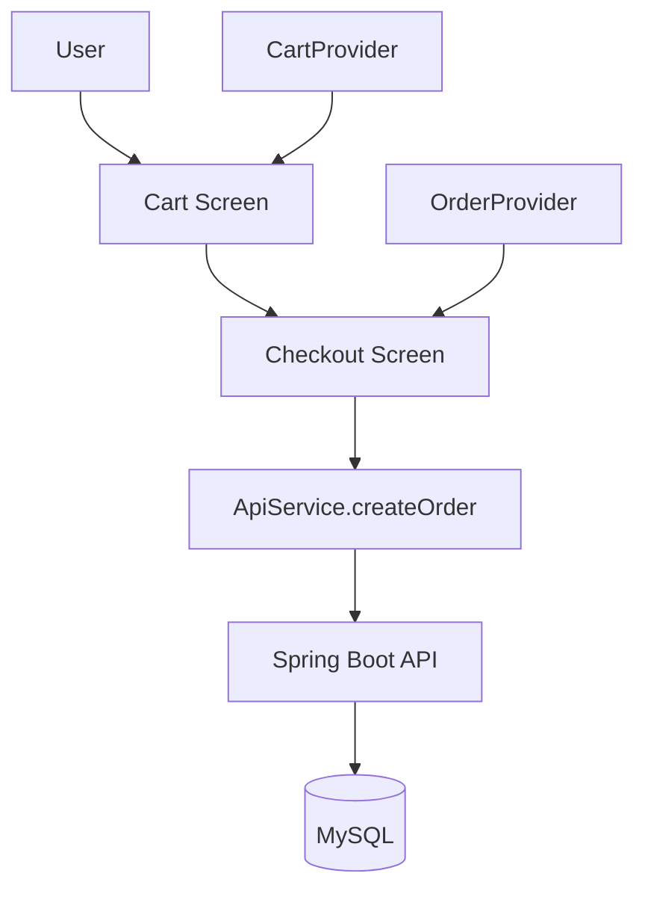

# Product Management App - Improvement Plan

## Overview

This plan addresses critical missing features and improvements needed for the product management app. The project uses Flutter (Clean Architecture) for frontend and Spring Boot for backend. Priority is given to completing the shopping flow (Cart → Checkout → Order) and implementing proper role-based access control (Admin/User) as it's essential for demo.

## Role-Based Access Control (RBAC) Requirements

### Admin Permissions:

- Full CRUD operations on Products (Create, Read, Update, Delete)
- Full CRUD operations on Categories
- View all Orders
- Update Order status
- Manage Users (if implemented)
- Access Admin Dashboard

### User Permissions:

- View Products (read-only)
- Search Products
- Add products to Cart
- View Cart
- Create Orders (checkout)
- View own Order History (by email)
- Update own Profile (if implemented)

### Security Rules:

- Admin screens must check `authProvider.isAdmin` before allowing access
- User screens should check `authProvider.isUser` or `authProvider.isAuthenticated`
- API calls should include JWT token in Authorization header
- Backend should validate JWT and check role for protected endpoints

## Architecture Flow




## Phase 0: Role-Based Access Control Implementation

### Task 0.1: Add Permission Check to Admin Screens

**Files to Update**:

- `product_management/lib/product_management/presentation/screens/product_form_screen.dart`
- `product_management/lib/product_management/presentation/screens/category_list_screen.dart`
- `product_management/lib/product_management/presentation/screens/order_list_screen.dart`

**Implementation**:

- Add `initState` check using `WidgetsBinding.instance.addPostFrameCallback`
- Check `context.read<AuthProvider>().isAdmin`
- If not admin, show error SnackBar and navigate back to LoginScreen
- Use same pattern as `AdminDashboardScreen._checkPermission()`

**Example Pattern**:

```dart
@override
void initState() {
  super.initState();
  WidgetsBinding.instance.addPostFrameCallback((_) {
    final authProvider = context.read<AuthProvider>();
    if (!authProvider.isAdmin) {
      ScaffoldMessenger.of(context).showSnackBar(
        const SnackBar(
          content: Text('Access Denied: Admin privileges required.'),
          backgroundColor: Colors.red,
        ),
      );
      Navigator.of(context).pushAndRemoveUntil(
        MaterialPageRoute(builder: (_) => const LoginScreen()),
        (route) => false,
      );
    }
  });
}
```


### Task 0.2: Protect Admin Actions in ProductProvider

**File**: `product_management/lib/product_management/presentation/providers/product_provider.dart`

- Add `AuthProvider` dependency or check role before allowing create/update/delete
- Show error message if user tries to perform admin action without permission
- Alternatively, hide admin actions in UI based on role (better UX)

### Task 0.3: Hide Admin Features from User UI

**Files to Update**:

- `product_management/lib/product_management/presentation/widgets/product_card_user.dart`
- `product_management/lib/product_management/presentation/screens/user_product_list_screen.dart`
- Ensure user screens don't show edit/delete buttons
- Only show "Add to Cart" button for users
- Verify no navigation to admin screens from user screens

### Task 0.4: Add User Email to AuthProvider

**File**: `product_management/lib/product_management/presentation/providers/auth_provider.dart`

- Add `_userEmail` string field
- Extract email from JWT token in `_setSession` method
- Add `userEmail` getter
- Save email to LocalStorage for order creation

**Implementation**:

```dart
String? _userEmail;

String? get userEmail => _userEmail;

// In _setSession:
final decoded = JwtParser.decode(token);
_userEmail = decoded['sub']?.toString() ?? decoded['email']?.toString();
```


### Task 0.5: Update User Profile Tab with Real Data

**File**: `product_management/lib/product_management/presentation/screens/user_main_screen.dart`

- Update `UserProfileTab` to show actual user email from `AuthProvider`
- Add "Order History" button that navigates to `UserOrderHistoryScreen`
- Display user role badge (User/Admin)

## Phase 1: Critical Features (Must Complete)

### Task 1.1: Implement Cart Screen

**File**: `product_management/lib/product_management/presentation/screens/cart_screen.dart`

- Replace placeholder with full implementation
- Display cart items from `CartProvider`
- Show product image, name, price, quantity
- Add quantity controls (increment/decrement buttons)
- Add remove item functionality
- Display total amount at bottom
- Add "Checkout" button that navigates to CheckoutScreen
- Handle empty cart state with friendly message
- Use design system colors from `design_system.dart`

**Dependencies**: CartProvider already exists, just needs UI

### Task 1.2: Enhance CartProvider

**File**: `product_management/lib/product_management/presentation/providers/cart_provider.dart`

- Add `updateQuantity(int productId, int quantity)` method
- Add validation to prevent quantity > product.quantity (stock check)
- Add `getItemCount()` getter for cart badge
- Consider adding `isEmpty` getter

### Task 1.3: Add createOrder API Method

**File**: `product_management/lib/api/api_service.dart`

- Add `Future<OrderModel> createOrder(OrderModel order)` method
- POST to `/orders` endpoint
- Convert OrderModel to JSON matching backend OrderDTO structure:
- customerName, email, phone, address, paymentMethod
- items: List of {productId, quantity}
- Handle response and return OrderModel
- Add proper error handling

**Backend Reference**: `api/src/main/java/com/husc/productmanagement/controller/OrderController.java` (line 46-50)

### Task 1.4: Add Order Repository Method

**File**: `product_management/lib/product_management/domain/repositories/repositories.dart`

- Add `Future<Order> createOrder(Order order)` to `OrderRepository` interface

**File**: `product_management/lib/product_management/data/repositories/repositories_impl.dart`

- Implement `createOrder` in `OrderRepositoryImpl`
- Call `ApiService.createOrder`
- Convert between OrderModel and Order entity

### Task 1.5: Add CreateOrder UseCase

**File**: `product_management/lib/product_management/domain/usecases/usecases.dart`

- Add `CreateOrderUseCase` class
- Takes OrderRepository and calls createOrder

### Task 1.6: Implement Checkout Screen

**File**: `product_management/lib/product_management/presentation/screens/checkout_screen.dart`

- Replace placeholder with full form implementation
- **Pre-fill form with user data if logged in**:
- Get email from `AuthProvider.userEmail`
- Pre-fill email field (can be editable or read-only)
- Optionally get name from user profile if available
- Form fields:
- Customer name (TextFormField, required)
- Email (TextFormField with email validation, required, pre-filled if user logged in)
- Phone (TextFormField, required, add phone validation)
- Address (TextFormField, multiline, required, min 10 characters)
- Payment method (Dropdown: "cash", "credit_card", "bank_transfer")
- Display order summary section:
- List all cart items with image, name, quantity, price, subtotal
- Show subtotal, tax (if applicable), shipping (if applicable)
- Show total amount prominently
- Use Card widget with proper styling
- Add "Place Order" button:
- Disabled when form is invalid or cart is empty
- Show loading indicator during submission
- Disable button during loading
- Show loading state during submission (CircularProgressIndicator overlay)
- Navigate to success screen or order history after success
- Clear cart after successful order using `CartProvider.clearCart()`
- Show error message if order creation fails
- Use design system colors from `design_system.dart`
- Add back button to return to cart

**Dependencies**: OrderProvider needs createOrder method, AuthProvider for user email**Role Check**: Only authenticated users (admin or user) can access checkout. Add check at screen entry.

### Task 1.7: Enhance OrderProvider

**File**: `product_management/lib/product_management/presentation/providers/order_provider.dart`

- Add `CreateOrderUseCase` dependency
- Add `createOrder` method that:
- Takes customer info and cart items
- Converts cart items to order items
- Calls use case
- Handles loading and error states
- Notifies listeners

## Phase 2: Error Handling & UX Improvements

### Task 2.1: Improve Error Handling in ApiService

**File**: `product_management/lib/api/api_service.dart`

- Add try-catch with specific error messages
- Parse DioException to user-friendly messages
- Handle network errors, 400, 401, 404, 500 errors
- Return meaningful error strings instead of rethrowing

### Task 2.2: Add Loading States to Providers

**Files**:

- `product_management/lib/product_management/presentation/providers/product_provider.dart`
- `product_management/lib/product_management/presentation/providers/order_provider.dart`
- `product_management/lib/product_management/presentation/providers/category_provider.dart`
- Add `_isLoading` boolean to each provider
- Set loading state during async operations
- Expose `isLoading` getter
- Update UI to show loading indicators

### Task 2.3: Add Error Messages to Providers

- Add `_errorMessage` string to providers
- Set error message on failures
- Expose `errorMessage` getter
- Clear error message on new operations
- Display error messages in UI (SnackBar or error widget)

### Task 2.4: Add Empty States

- Update product list screens to show empty state when no products
- Update cart screen to show empty state (already planned in 1.1)
- Add friendly messages and icons

## Phase 3: Additional Features

### Task 3.1: Product Detail Screen

**New File**: `product_management/lib/product_management/presentation/screens/product_detail_screen.dart`

- Display full product information
- Large product image
- Name, price, description (if available)
- Stock quantity
- Average rating (if available)
- "Add to Cart" button
- Navigate from product list when tapping product card

**Update**: `product_management/lib/product_management/presentation/widgets/product_card_user.dart`

- Make card tappable to navigate to detail screen

### Task 3.2: User Order History Screen

**New File**: `product_management/lib/product_management/presentation/screens/user_order_history_screen.dart`

- **Role Check**: Only accessible to authenticated users (not guests)
- Fetch orders by user email using `AuthProvider.userEmail`
- Display list of orders with:
- Order code (tappable, navigate to detail)
- Date formatted nicely (use intl package)
- Total amount with currency format
- Status with color coding (pending=yellow, paid=green, shipped=blue, cancelled=red)
- Number of items in order
- Tap order to see details (show order items, customer info, etc.)
- Add pull-to-refresh functionality
- Show empty state if no orders
- Add API method: `getOrdersByEmail(String email)` in ApiService
- Add to user navigation in `UserMainScreen` or `UserProfileTab`
- Add loading state while fetching orders
- Handle errors gracefully

**Role Restriction**: This screen is for regular users only. Admin should use OrderListScreen instead.

### Task 3.3: Update ApiService for Order by Email

**File**: `product_management/lib/api/api_service.dart`

- Add `Future<List<OrderModel>> getOrdersByEmail(String email)` method
- GET `/orders/customer/{email}`

## Phase 4: Security & Backend Improvements

### Task 4.1: Implement JWT Authentication Filter (Recommended)

**New File**: `api/src/main/java/com/husc/productmanagement/config/JwtAuthenticationFilter.java`

- Create JWT filter that:
- Extracts JWT token from Authorization header
- Validates token using JwtUtil
- Extracts user role from token
- Sets authentication in SecurityContext
- Handle token expiration
- Handle invalid tokens

**File**: `api/src/main/java/com/husc/productmanagement/config/SecurityConfig.java`

- Remove `.anyRequest().permitAll()`
- Add JWT filter to filter chain
- Protect admin endpoints:
- `/api/products` POST, PUT, DELETE (require ADMIN role)
- `/api/categories` POST, PUT, DELETE (require ADMIN role)
- `/api/orders/{id}/status` PATCH (require ADMIN role)
- `/api/users/**` (require ADMIN role)
- Keep public:
- `/api/auth/**` (login, register)
- `/api/products` GET (view products)
- `/api/categories` GET (view categories)
- `/api/orders` POST (create order - users can create orders)
- Add role-based authorization using `.hasRole("ADMIN")` or `.hasAuthority("ROLE_ADMIN")`

**Priority**: Medium - Important for proper security, but can work without it for demo if backend allows all requests

### Task 4.2: Add Role Validation in Backend Controllers (Recommended)

**Files to Update**:

- `api/src/main/java/com/husc/productmanagement/controller/ProductController.java`
- `api/src/main/java/com/husc/productmanagement/controller/CategoryController.java`
- `api/src/main/java/com/husc/productmanagement/controller/OrderController.java`
- Add `@PreAuthorize("hasRole('ADMIN')")` annotation to admin-only methods:
- ProductController: createProduct, updateProduct, deleteProduct
- CategoryController: createCategory, updateCategory, deleteCategory
- OrderController: updateOrderStatus (admin only)
- Keep GET methods public or allow both roles
- Add `@PreAuthorize("hasRole('USER') or hasRole('ADMIN')")` for user-accessible endpoints

**Note**: Requires `@EnableMethodSecurity` in SecurityConfig

### Task 4.3: Add Input Validation

**Files to Update**:

- `product_management/lib/product_management/presentation/screens/checkout_screen.dart`
- `product_management/lib/product_management/presentation/screens/product_form_screen.dart`
- `product_management/lib/product_management/presentation/providers/cart_provider.dart`
- Add form validation in Flutter:
- Email: Use `EmailValidator` or regex pattern
- Phone: Vietnamese phone format (10-11 digits, starts with 0)
- Address: Minimum 10 characters, required
- Name: Minimum 2 characters, required
- Price: Must be > 0, numeric
- Quantity: Must be > 0, integer
- Ensure quantity > 0 in cart (prevent negative or zero)
- Validate email format in checkout (use built-in email validator)
- Validate phone number format (Vietnamese format: 0xxxxxxxxx)
- Show validation errors clearly below each field
- Disable submit button if form is invalid

## Implementation Notes

1. **Order Model Mapping**: Ensure OrderModel matches backend OrderDTO structure. Check `api/src/main/java/com/husc/productmanagement/dto/OrderDTO.java` for required fields. OrderDTO expects:

- customerName, email, phone, address (all required)
- paymentMethod (required)
- items: List of OrderItemDTO with productId and quantity

2. **Error Messages**: Create a helper class or constants for consistent error messages. Consider creating `product_management/lib/core/utils/error_messages.dart`:
   ```dart
      class ErrorMessages {
        static const networkError = 'Network error. Please check your connection.';
        static const unauthorized = 'Unauthorized. Please login again.';
        static const forbidden = 'Access denied. Admin privileges required.';
        // etc.
      }
   ```


3. **Navigation**: Use Navigator.push/pop for screen navigation. Consider using named routes if app grows. For role-based navigation:

- Check `AuthProvider.isAdmin` before navigating to admin screens
- Check `AuthProvider.isAuthenticated` before checkout/order history

4. **State Management**: All providers already use ChangeNotifier pattern. Ensure notifyListeners() is called after state changes. Remember to:

- Set loading state before async operations
- Clear loading state after completion (success or error)
- Clear error messages on new operations

5. **Role-Based Access**: Always check user role before:

- Showing admin UI elements
- Navigating to admin screens
- Performing admin actions
- Making admin API calls

6. **Testing**: After each phase, test the complete flow:

- **As User**: Login → Browse products → Add to cart → View cart → Checkout → Place order → View order history
- **As Admin**: Login → View products → Create/Edit/Delete product → View orders → Update order status
- **Security**: Try accessing admin screens as user (should be blocked)
- **Security**: Try performing admin actions as user (should show error)

## File Structure Reference

- **Models**: `product_management/lib/product_management/data/models/`
- **Repositories**: `product_management/lib/product_management/data/repositories/`
- **Domain**: `product_management/lib/product_management/domain/`
- **UI**: `product_management/lib/product_management/presentation/`
- **API**: `product_management/lib/api/api_service.dart`
- **Backend Controllers**: `api/src/main/java/com/husc/productmanagement/controller/`
- **Backend DTOs**: `api/src/main/java/com/husc/productmanagement/dto/`

## Success Criteria

### Functional Requirements:

- ✅ User can add products to cart
- ✅ User can view and modify cart (quantity, remove items)
- ✅ User can complete checkout and place order
- ✅ Order appears in admin order list
- ✅ Admin can view and manage all orders
- ✅ User can view their own order history
- ✅ Error messages are user-friendly
- ✅ Loading states are visible during operations
- ✅ Empty states are handled gracefully

### Security Requirements:

- ✅ Admin screens are protected (only accessible to admins)
- ✅ User screens are accessible to authenticated users
- ✅ Admin actions (create/update/delete products) are restricted to admins
- ✅ Users cannot access admin features
- ✅ JWT token is included in API requests
- ✅ Backend validates JWT and role (if implemented)

### UX Requirements:

- ✅ Forms have proper validation
- ✅ Error messages are clear and actionable
- ✅ Loading indicators show during async operations
- ✅ Success feedback after operations (SnackBar)
- ✅ Navigation flows are intuitive
- ✅ Role-appropriate UI elements are shown/hidden correctly

## Detailed Implementation Steps

### Step-by-Step Execution Order:

1. **Phase 0** (Role-Based Access Control) - Do this first to establish security foundation
2. **Phase 1** (Critical Features) - Complete shopping flow
3. **Phase 2** (Error Handling & UX) - Improve user experience
4. **Phase 3** (Additional Features) - Nice-to-have features
5. **Phase 4** (Security & Backend) - Production-ready security

### Quick Start Checklist:

Before starting implementation, ensure:

- [ ] Backend API is running and accessible
- [ ] Database is set up with sample data
- [ ] JWT tokens are being generated correctly with role information
- [ ] Flutter app can connect to backend (check API_URL in .env)
- [ ] AuthProvider is working (can login and get role)

### Testing Checklist:

After each task, test:

- [ ] Feature works as expected
- [ ] Role-based access is enforced
- [ ] Error handling works
- [ ] Loading states appear
- [ ] UI is responsive and looks good
- [ ] No console errors or warnings

---

## PROMPT CHI TIẾT ĐỂ THỰC HIỆN PLAN

### Hướng dẫn sử dụng prompt này:

Khi bạn muốn thực hiện plan này, hãy copy prompt dưới đây và gửi cho AI assistant. Prompt này chứa tất cả thông tin cần thiết để thực hiện từng task một cách chi tiết.---

## PROMPT CHO AI ASSISTANT:

Bạn là một Flutter và Spring Boot developer chuyên nghiệp. Tôi cần bạn giúp tôi hoàn thiện ứng dụng Product Management với các yêu cầu sau:

### CONTEXT DỰ ÁN:

Đây là một dự án Flutter (Clean Architecture) kết nối với Spring Boot backend. Ứng dụng có 2 loại user:

- **Admin**: Quản lý sản phẩm, danh mục, đơn hàng
- **User**: Xem sản phẩm, thêm vào giỏ hàng, đặt hàng

### YÊU CẦU QUAN TRỌNG VỀ PHÂN QUYỀN:

1. **Admin chỉ có thể**:

- CRUD sản phẩm (create, update, delete)
- CRUD danh mục
- Xem và quản lý tất cả đơn hàng
- Cập nhật trạng thái đơn hàng
- Truy cập Admin Dashboard

2. **User chỉ có thể**:

- Xem danh sách sản phẩm (read-only)
- Tìm kiếm sản phẩm
- Thêm sản phẩm vào giỏ hàng
- Xem giỏ hàng
- Đặt hàng (checkout)
- Xem lịch sử đơn hàng của chính mình

3. **Bảo mật**:

- Tất cả màn hình admin phải check `authProvider.isAdmin` trước khi cho phép truy cập
- Nếu user không phải admin cố truy cập admin screen → hiển thị lỗi và redirect về LoginScreen
- Ẩn các nút/action admin khỏi UI của user
- API calls phải include JWT token trong header

### CẤU TRÚC FILE HIỆN TẠI:

- **Flutter App**: `product_management/lib/`
- Models: `product_management/data/models/`
- Repositories: `product_management/data/repositories/`
- Domain: `product_management/domain/`
- UI: `product_management/presentation/`
- API Service: `api/api_service.dart`
- AuthProvider: `product_management/presentation/providers/auth_provider.dart` (đã có isAdmin, isUser, role)
- **Backend**: `api/src/main/java/com/husc/productmanagement/`
- Controllers: `controller/`
- Services: `service/`
- DTOs: `dto/`
- Entities: `entity/`
- Config: `config/SecurityConfig.java`

### CÁC TASK CẦN THỰC HIỆN (theo thứ tự ưu tiên):

#### PHASE 0: Role-Based Access Control (Làm đầu tiên)

**Task 0.1**: Bảo vệ các màn hình admin

- File: `product_management/lib/product_management/presentation/screens/product_form_screen.dart`
- Thêm check permission trong `initState()`:
  ```dart
    @override
    void initState() {
      super.initState();
      WidgetsBinding.instance.addPostFrameCallback((_) {
        final authProvider = context.read<AuthProvider>();
        if (!authProvider.isAdmin) {
          ScaffoldMessenger.of(context).showSnackBar(
            const SnackBar(
              content: Text('Access Denied: Admin privileges required.'),
              backgroundColor: Colors.red,
            ),
          );
          Navigator.of(context).pushAndRemoveUntil(
            MaterialPageRoute(builder: (_) => const LoginScreen()),
            (route) => false,
          );
        }
      });
    }
  ```


- Áp dụng tương tự cho: `category_list_screen.dart`, `order_list_screen.dart`

**Task 0.2**: Thêm userEmail vào AuthProvider

- File: `product_management/lib/product_management/presentation/providers/auth_provider.dart`
- Thêm field `String? _userEmail`
- Thêm getter `String? get userEmail => _userEmail;`
- Trong method `_setSession`, extract email từ JWT token:
  ```dart
    final decoded = JwtParser.decode(token);
    _userEmail = decoded['sub']?.toString() ?? decoded['email']?.toString();
  ```


**Task 0.3**: Cập nhật UserProfileTab với dữ liệu thật

- File: `product_management/lib/product_management/presentation/screens/user_main_screen.dart`
- Lấy email từ `AuthProvider.userEmail` thay vì hardcode
- Thêm button "Order History" navigate đến `UserOrderHistoryScreen`

#### PHASE 1: Critical Features (Cart, Checkout, Order)

**Task 1.1**: Implement Cart Screen

- File: `product_management/lib/product_management/presentation/screens/cart_screen.dart`
- Hiển thị danh sách items từ `CartProvider`
- Mỗi item hiển thị: image, name, price, quantity controls (+/-), remove button
- Hiển thị total amount ở bottom
- Button "Checkout" navigate đến CheckoutScreen
- Empty state: "Your cart is empty" với icon
- Sử dụng design system colors

**Task 1.2**: Enhance CartProvider

- File: `product_management/lib/product_management/presentation/providers/cart_provider.dart`
- Thêm method `updateQuantity(int productId, int quantity)`
- Validate: quantity không được > product.quantity (stock)
- Thêm getter `int getItemCount()` để hiển thị badge
- Thêm getter `bool get isEmpty => _items.isEmpty;`

**Task 1.3**: Add createOrder API Method

- File: `product_management/lib/api/api_service.dart`
- Thêm method:
  ```dart
    Future<OrderModel> createOrder({
      required String customerName,
      required String email,
      required String phone,
      required String address,
      required String paymentMethod,
      required List<Map<String, dynamic>> items, // [{productId: int, quantity: int}]
    }) async {
      try {
        final response = await _dio.post(
          '/orders',
          data: {
            'customerName': customerName,
            'email': email,
            'phone': phone,
            'address': address,
            'paymentMethod': paymentMethod,
            'items': items,
          },
        );
        return OrderModel.fromJson(response.data['data']);
      } catch (e) {
        // Handle error
        rethrow;
      }
    }
  ```


**Task 1.4-1.5**: Add Repository và UseCase

- File: `product_management/lib/product_management/domain/repositories/repositories.dart`
- Thêm `Future<Order> createOrder(Order order)` vào `OrderRepository`
- File: `product_management/lib/product_management/data/repositories/repositories_impl.dart`
- Implement `createOrder` trong `OrderRepositoryImpl`
- File: `product_management/lib/product_management/domain/usecases/usecases.dart`
- Thêm `CreateOrderUseCase` class

**Task 1.6**: Implement Checkout Screen

- File: `product_management/lib/product_management/presentation/screens/checkout_screen.dart`
- Form với các field:
- Customer name (required, min 2 chars)
- Email (required, email validation, pre-fill từ AuthProvider.userEmail)
- Phone (required, Vietnamese format: 0xxxxxxxxx)
- Address (required, multiline, min 10 chars)
- Payment method (Dropdown: cash, credit_card, bank_transfer)
- Order summary section: hiển thị tất cả items từ cart với image, name, quantity, price, subtotal
- Total amount hiển thị rõ ràng
- Button "Place Order":
- Disabled khi form invalid hoặc cart empty
- Show loading khi đang submit
- Sau khi thành công: clear cart, navigate về order history hoặc show success message
- Check authentication: chỉ user đã login mới được checkout

**Task 1.7**: Enhance OrderProvider

- File: `product_management/lib/product_management/presentation/providers/order_provider.dart`
- Thêm `CreateOrderUseCase` dependency
- Thêm method:
  ```dart
    Future<bool> createOrder({
      required String customerName,
      required String email,
      required String phone,
      required String address,
      required String paymentMethod,
      required List<CartItem> cartItems,
    }) async {
      _isLoading = true;
      _errorMessage = null;
      notifyListeners();
      
      try {
        // Convert cart items to order items
        final orderItems = cartItems.map((item) => {
          'productId': item.product.id,
          'quantity': item.quantity,
        }).toList();
        
        // Create Order entity
        final order = Order(...);
        
        // Call use case
        await _createOrderUseCase(order);
        
        _isLoading = false;
        notifyListeners();
        return true;
      } catch (e) {
        _isLoading = false;
        _errorMessage = e.toString();
        notifyListeners();
        return false;
      }
    }
  ```


#### PHASE 2: Error Handling & UX

**Task 2.1**: Improve Error Handling

- File: `product_management/lib/api/api_service.dart`
- Tạo helper method để parse DioException:
  ```dart
    String _parseError(DioException e) {
      if (e.type == DioExceptionType.connectionTimeout || 
          e.type == DioExceptionType.receiveTimeout) {
        return 'Connection timeout. Please check your internet.';
      }
      if (e.response?.statusCode == 400) {
        return e.response?.data['message'] ?? 'Invalid request.';
      }
      if (e.response?.statusCode == 401) {
        return 'Unauthorized. Please login again.';
      }
      if (e.response?.statusCode == 403) {
        return 'Access denied. Admin privileges required.';
      }
      if (e.response?.statusCode == 404) {
        return 'Resource not found.';
      }
      if (e.response?.statusCode == 500) {
        return 'Server error. Please try again later.';
      }
      return 'An error occurred: ${e.message}';
    }
  ```


- Sử dụng helper này trong tất cả API methods

**Task 2.2-2.3**: Add Loading & Error States

- Cập nhật tất cả providers (ProductProvider, OrderProvider, CategoryProvider)
- Đảm bảo có `_isLoading` và `_errorMessage`
- Expose getters và clear errors khi bắt đầu operation mới

#### PHASE 3: Additional Features

**Task 3.1**: Product Detail Screen

- Tạo file mới: `product_management/lib/product_management/presentation/screens/product_detail_screen.dart`
- Hiển thị full product info: image lớn, name, price, stock, rating
- Button "Add to Cart"
- Update `product_card_user.dart` để navigate đến detail screen khi tap

**Task 3.2**: User Order History Screen

- Tạo file mới: `product_management/lib/product_management/presentation/screens/user_order_history_screen.dart`
- Check authentication: chỉ user đã login mới được xem
- Fetch orders bằng `getOrdersByEmail(AuthProvider.userEmail)`
- Hiển thị list orders với: order code, date, total, status (có màu)
- Tap để xem chi tiết
- Empty state nếu không có orders

**Task 3.3**: Add getOrdersByEmail API

- File: `product_management/lib/api/api_service.dart`
- Thêm method:
  ```dart
    Future<List<OrderModel>> getOrdersByEmail(String email) async {
      try {
        final response = await _dio.get('/orders/customer/$email');
        final data = response.data['data'] as List;
        return data.map((e) => OrderModel.fromJson(e)).toList();
      } catch (e) {
        rethrow;
      }
    }
  ```


### LƯU Ý QUAN TRỌNG:

1. **Luôn check role trước khi cho phép truy cập admin features**
2. **Pre-fill email trong checkout form từ AuthProvider**
3. **Validate tất cả form inputs**
4. **Show loading states trong mọi async operations**
5. **Handle errors gracefully với user-friendly messages**
6. **Sử dụng design system colors từ `design_system.dart`**
7. **Test cả flow user và admin sau mỗi task**

### KHI THỰC HIỆN:

Hãy làm từng task một, test kỹ trước khi chuyển sang task tiếp theo. Nếu có lỗi hoặc cần clarify, hãy hỏi tôi trước khi tiếp tục.